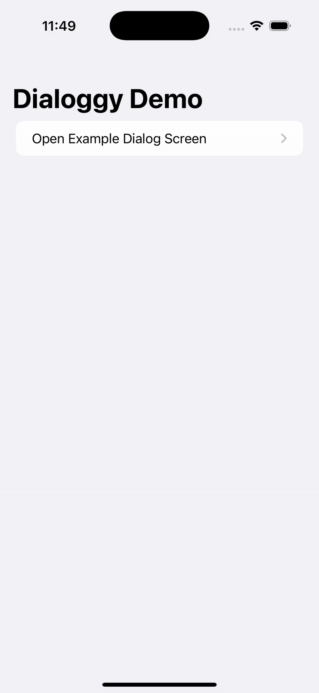

# 📦 Dialoggy
  
**Dialoggy** is a lightweight and flexible SwiftUI library for displaying custom dialogs in iOS apps.

## ✨ Features

- Fully customizable buttons, fonts, and colors  
- Easy to integrate via `.dialogable()` modifier  
- Supports multiple actions  
- Optional icon/image support  
- iOS 17+ compatibility  

---

## 📺 Preview


## 🚀 Installation

**Swift Package Manager**

Add Dialoggy to your `Package.swift`:

```swift
.package(url: "https://github.com/yourname/Dialoggy.git", from: "1.0.3")
```

Or via Xcode:  
**File → Add Packages…** and paste the repo URL.

---

## 🧪 Usage Example

```swift
struct ContentView: View {
    @State private var dialog: DialogModel?

    var body: some View {
        VStack {
            Button("Show Dialog") {
                dialog = DialogModel(
                    title: "Hello!",
                    message: "This is an example dialog.",
                    actions: [
                        DialogAction(title: "OK", style: .primary) {
                            dialog = nil
                        }
                    ]
                )
            }
        }
        .dialog($dialog)
        .dialogable(style: DialogStyleConfig.default)
    }
}
```

---

## 🎨 Customization

```swift
DialogStyleConfig(
    primaryButtonStyle: DialogButtonStyle(
        backgroundColor: .blue,
        foregroundColor: .white,
        cornerRadius: 10
    ),
    secondaryButtonStyle: DialogButtonStyle(
        backgroundColor: .gray.opacity(0.2),
        foregroundColor: .black,
        cornerRadius: 10
    ),
    titleFont: .title2,
    titleForegroundColor: .primary,
    messageFont: .body,
    messageForegroundColor: .secondary,
    imageSize: CGSize(width: 64, height: 64)
)
```

---

## 📂 Example

See [`Examples/DialoggyDemo.swift`](./Examples/DialoggyDemo.swift) for a live demo with multiple configurations.

---

## 📄 License

MIT
